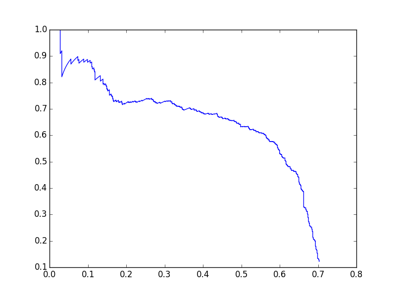

# object\_detection\_mAP
This is a script to compute mAP in object detection, if you want to know more about mAP, please read [this paper](http://homepages.inf.ed.ac.uk/ckiw/postscript/ijcv_voc09.pdf)

### Usage

    python map.py example/val_pred.csv example/val_gt.csv
 
then it will print mAP score and plot precision/recall curve:

